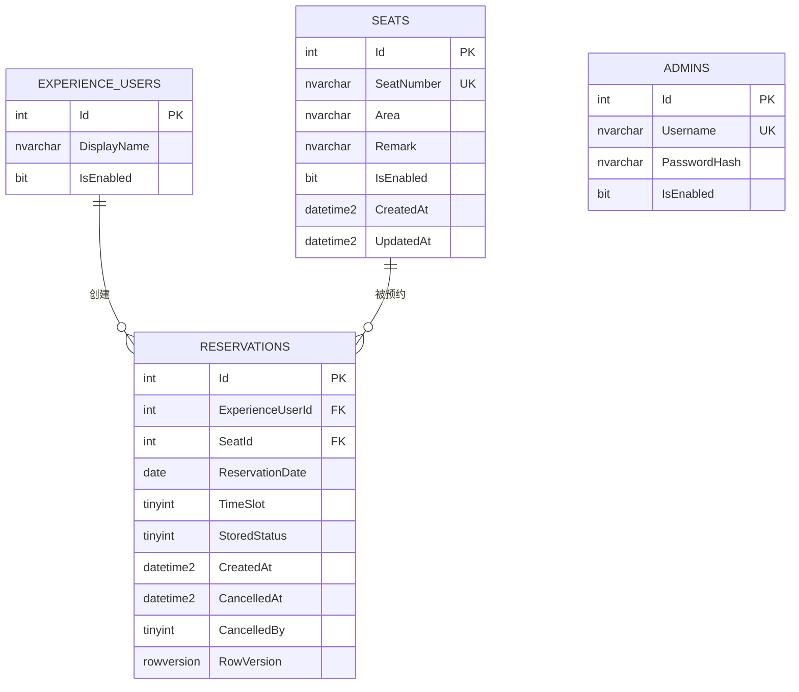

# 图书馆座位预约系统数据库设计

## 文档信息

| 项目 | 内容 |
| --- | --- |
| 数据库 | SQL Server LocalDB |
| 数据访问 | EF Core 8 |
| 数据骨架来源 | `docs/03-PRD-Lite.md`、`docs/04-页面树与业务流程.md`、`docs/07-系统设计说明.md` |
| 核心实体数量 | 4 个 |
| 下一步 | 关键链路详细设计 |

## 0. 前序文档提取结果

本节先汇总前序文档已经明确的数据要求，后续表结构以这些要求为准。

### 0.1 已确认实体与关系

| 实体 | 前序已确认用途 | 已确认关系 |
| --- | --- | --- |
| `ExperienceUser` | 预置体验用户，当前用户编号保存在 Session | 一个体验用户有多条预约 |
| `Admin` | 预置管理员账号，使用 Cookie 登录 | 本期只有认证用途，不建设角色和权限关系 |
| `Seat` | 保存座位编号、区域、备注和启停状态 | 一个座位有多条预约 |
| `Reservation` | 保存体验用户对座位、日期和固定时段的预约 | 每条预约属于一个体验用户和一个座位 |

前序文档已明确只保留 4 个核心对象，因此本设计不采用默认的 6 实体起点，不新增 `SeatArea`、`TimeSlot` 和 `ReservationLog` 表。

### 0.2 已确认状态

1. 座位只保存 `IsEnabled`，表示启用或停用。
2. 预约存储状态 `StoredStatus` 只包含 `Reserved`、`Cancelled`。
3. 页面展示状态包含已预约、已取消、已完成。
4. “已完成”不入库，由 `StoredStatus`、预约日期、时段结束时间和当前时间动态计算。
5. 取消后记录 `CancelledAt` 和 `CancelledBy`，其中取消方为 `Student` 或 `Admin`。

### 0.3 已确认查询与统计

1. 用户端按区域筛选座位。
2. 用户端查询当前体验用户自己的预约。
3. 预约提交页按座位、当前体验用户和日期查询 3 个固定时段是否存在座位冲突或用户冲突。
4. 管理端预约查询能力需要支持日期、展示状态、区域、体验用户四类条件；A-P02 首版页面只暴露日期和展示状态。
5. 管理端座位列表需要支持按区域和启停状态查询。
6. 统计页只需要座位总数、启用座位数、停用座位数、预约总数、今日非取消预约数 5 个数字。

### 0.4 已确认约束

1. 座位编号必填且唯一。
2. 同一座位、同一日期、同一时段只能存在一条有效预约。
3. 同一体验用户、同一日期、同一时段只能存在一条有效预约。
4. 只有 `StoredStatus = Reserved` 的记录参与冲突判断。
5. 已取消记录不占用座位，也不阻止用户重新预约。
6. 用户只能取消自己的、尚未开始的有效预约。
7. 管理员只能取消尚未结束的有效预约。
8. 座位和预约均不做物理删除。
9. 预约日期只能是服务器当天至当天 + 6 天；当天已开始时段不能预约。

## 1. 数据设计目标

1. 使用 4 张核心表支撑用户预约和管理员管理两条业务闭环。
2. 同时从 Service 和数据库两层阻止座位冲突与用户冲突。
3. 保留已取消和动态已完成的历史记录，不依赖物理删除或定时改状态。
4. 支撑用户端区域筛选、时段可用性、我的预约，以及管理端日期、状态、区域、用户查询；A-P02 首版 UI 只展示日期和状态筛选。
5. 支撑 5 个固定统计指标，不为趋势图和报表增加额外表。
6. 保持 EF Core Mapping、Migration 和种子数据容易实现、重建和演示。

## 2. 核心实体清单

| 实体 | 对应表 | 主键 | 主要字段 | 是否独立维护 |
| --- | --- | --- | --- | --- |
| `ExperienceUser` | `ExperienceUsers` | `Id` | `DisplayName`、`IsEnabled` | 仅种子数据，本期无管理页面 |
| `Admin` | `Admins` | `Id` | `Username`、`PasswordHash`、`IsEnabled` | 仅种子数据，本期无账号管理页面 |
| `Seat` | `Seats` | `Id` | `SeatNumber`、`Area`、`Remark`、`IsEnabled` | 管理端可新增、编辑和启停 |
| `Reservation` | `Reservations` | `Id` | 用户、座位、日期、时段、存储状态、取消信息 | 用户创建，用户或管理员取消 |

### 2.1 不拆表说明

| 未拆分对象 | 当前设计 | 原因 |
| --- | --- | --- |
| 座位区域 | `Seats.Area` 使用短文本 | 本期无区域管理、楼层关系和区域余量业务 |
| 固定时段 | `Reservations.TimeSlot` 使用枚举值 | 只有固定 3 个时段，不允许后台配置 |
| 预约日志 | 取消字段直接保存在 `Reservations` | 本期只有创建和一次取消，不做审批和完整操作轨迹 |
| 页面展示状态 | 查询时动态计算 | “已完成”取决于当前时间，不应重复存储 |

## 3. 关系说明与 ER 图

### 3.1 关系说明

1. `ExperienceUsers (1) -> (N) Reservations`：一名体验用户可以创建多条预约；一条预约必须属于一名体验用户。
2. `Seats (1) -> (N) Reservations`：一个座位可以在不同日期或时段有多条预约；一条预约必须对应一个座位。
3. `Admins` 本期只用于 Cookie 登录校验，不与预约建立外键。预约通过 `CancelledBy = Admin` 记录取消方类型。
4. ExperienceUser、Seat 被预约引用后禁止物理删除，外键删除行为使用 `Restrict`。

### 3.2 ER 图



## 4. 表结构设计

### 4.1 ExperienceUsers

| 字段 | SQL Server 类型 | EF Core/C# 类型 | 可空 | 默认值 | 说明 |
| --- | --- | --- | --- | --- | --- |
| `Id` | `int identity(1,1)` | `int` | 否 | 自增 | 主键 |
| `DisplayName` | `nvarchar(50)` | `string` | 否 | 无 | 体验账号展示名 |
| `IsEnabled` | `bit` | `bool` | 否 | `1` | 停用后不能切换或新建预约 |

**约束与索引：**

1. 主键：`PK_ExperienceUsers (Id)`。
2. `DisplayName` 非空且去除首尾空格后长度大于 0；由 ViewModel 和 Service 校验。
3. 本期只有 2 个种子用户，不为 `DisplayName` 增加唯一约束，避免把展示名称当登录账号。

### 4.2 Admins

| 字段 | SQL Server 类型 | EF Core/C# 类型 | 可空 | 默认值 | 说明 |
| --- | --- | --- | --- | --- | --- |
| `Id` | `int identity(1,1)` | `int` | 否 | 自增 | 主键 |
| `Username` | `nvarchar(50)` | `string` | 否 | 无 | 管理员登录名 |
| `PasswordHash` | `nvarchar(255)` | `string` | 否 | 无 | 密码哈希，不保存明文 |
| `IsEnabled` | `bit` | `bool` | 否 | `1` | 停用后不能登录 |

**约束与索引：**

1. 主键：`PK_Admins (Id)`。
2. 唯一索引：`UX_Admins_Username (Username)`。
3. 用户名比较沿用数据库默认不区分大小写排序规则，不在业务层再建立另一套大小写规则。

### 4.3 Seats

| 字段 | SQL Server 类型 | EF Core/C# 类型 | 可空 | 默认值 | 说明 |
| --- | --- | --- | --- | --- | --- |
| `Id` | `int identity(1,1)` | `int` | 否 | 自增 | 主键 |
| `SeatNumber` | `nvarchar(20)` | `string` | 否 | 无 | 座位展示编号，例如 `A-001` |
| `Area` | `nvarchar(50)` | `string` | 否 | 无 | 区域短文本，例如“安静区” |
| `Remark` | `nvarchar(200)` | `string?` | 是 | `NULL` | 座位属性说明，例如“靠窗、近电源” |
| `IsEnabled` | `bit` | `bool` | 否 | `1` | 是否允许产生新预约 |
| `CreatedAt` | `datetime2(0)` | `DateTime` | 否 | 应用写入 | 创建时间 |
| `UpdatedAt` | `datetime2(0)` | `DateTime` | 否 | 应用写入 | 最后更新时间 |

**约束与索引：**

1. 主键：`PK_Seats (Id)`。
2. 唯一索引：`UX_Seats_SeatNumber (SeatNumber)`。
3. 查询索引：`IX_Seats_Area_IsEnabled (Area, IsEnabled)`，支持区域与启停筛选。
4. `SeatNumber`、`Area` 保存前统一 `Trim()`；空白字符串由 Service 拒绝。
5. 停用只更新 `IsEnabled`，不删除 Seat，不级联处理已有预约。

### 4.4 Reservations

| 字段 | SQL Server 类型 | EF Core/C# 类型 | 可空 | 默认值 | 说明 |
| --- | --- | --- | --- | --- | --- |
| `Id` | `int identity(1,1)` | `int` | 否 | 自增 | 主键 |
| `ExperienceUserId` | `int` | `int` | 否 | 无 | 外键，关联体验用户 |
| `SeatId` | `int` | `int` | 否 | 无 | 外键，关联座位 |
| `ReservationDate` | `date` | `DateOnly` | 否 | 无 | 预约日期，不保存时间部分 |
| `TimeSlot` | `tinyint` | `ReservationTimeSlot` | 否 | 无 | Morning、Afternoon、Evening |
| `StoredStatus` | `tinyint` | `ReservationStatus` | 否 | `1` | Reserved、Cancelled |
| `CreatedAt` | `datetime2(0)` | `DateTime` | 否 | 应用写入 | 预约创建时间 |
| `CancelledAt` | `datetime2(0)` | `DateTime?` | 是 | `NULL` | 取消发生时间 |
| `CancelledBy` | `tinyint` | `CancellationActor?` | 是 | `NULL` | Student 或 Admin |
| `RowVersion` | `rowversion` | `byte[]` | 否 | 数据库生成 | 并发令牌，用于识别重复取消或状态变化 |

**外键：**

1. `FK_Reservations_ExperienceUsers_ExperienceUserId`，删除行为 `Restrict`。
2. `FK_Reservations_Seats_SeatId`，删除行为 `Restrict`。

**普通查询索引：**

1. `IX_Reservations_ReservationDate_StoredStatus (ReservationDate, StoredStatus)`：管理端日期/状态筛选和今日统计。
2. `IX_Reservations_ExperienceUserId_ReservationDate (ExperienceUserId, ReservationDate)`：我的预约和按用户查询。
3. `IX_Reservations_SeatId_ReservationDate (SeatId, ReservationDate)`：座位详情的时段占用查询和历史查询。

**有效预约过滤唯一索引：**

```text
UX_Reservations_Seat_Date_TimeSlot_Reserved
  (SeatId, ReservationDate, TimeSlot)
  WHERE StoredStatus = 1

UX_Reservations_User_Date_TimeSlot_Reserved
  (ExperienceUserId, ReservationDate, TimeSlot)
  WHERE StoredStatus = 1
```

这两个索引是冲突的数据库最终防线。`StoredStatus = 2` 的已取消记录不进入索引，因此取消后相同座位或用户可以重新预约同一时段，也可以保留多条历史取消记录。

## 5. 关键字段说明

### 5.1 ReservationDate 与 TimeSlot

1. `ReservationDate` 使用 SQL `date` 和 C# `DateOnly`，避免时区或时间部分造成日期比较偏差。
2. `TimeSlot` 不单独建表，固定枚举值如下：

| 数值 | C# 枚举 | 展示文本 | 开始时间 | 结束时间 |
| --- | --- | --- | --- | --- |
| `1` | `Morning` | 上午 | 08:00 | 12:00 |
| `2` | `Afternoon` | 下午 | 14:00 | 18:00 |
| `3` | `Evening` | 晚上 | 18:30 | 21:30 |

3. 起止时间只在一处映射，供可预约判断、取消判断和展示状态计算共同使用。
4. 7 天范围和当天过期时段属于动态业务规则，由 Service 使用统一 `TimeProvider` 校验，不写成数据库 CHECK 约束。

### 5.2 StoredStatus

| 数值 | C# 枚举 | 含义 | 是否参与冲突 |
| --- | --- | --- | --- |
| `1` | `Reserved` | 有效预约或已结束但未取消的预约 | 是 |
| `2` | `Cancelled` | 已被用户或管理员取消 | 否 |

`Completed` 不是存储值。禁止在后续 Migration 中增加 `Completed = 3`。

### 5.3 CancelledAt 与 CancelledBy

| 数值 | C# 枚举 | 含义 |
| --- | --- | --- |
| `1` | `Student` | 当前预约所属体验用户取消 |
| `2` | `Admin` | 已登录管理员取消 |

本期只需记录取消方类型，不保存取消操作者外键：学生只能取消自己的预约，Reservation 已包含所属 `ExperienceUserId`；系统只有 1 个预置管理员，也没有管理员审计页面。该选择避免多态外键和额外日志表。

### 5.4 RowVersion

1. `RowVersion` 配置为 EF Core 并发令牌。
2. 两个请求同时取消同一预约时，先保存者成功，后保存者得到并发异常并转换为“预约状态已变化，请刷新后重试”。
3. RowVersion 不展示给普通用户；表单可使用隐藏字段或由 Service 重新读取后进行状态校验。

## 6. 状态字段设计

### 6.1 预约状态流转

| 原存储状态 | 操作/时间条件 | 新存储状态 | 展示状态 |
| --- | --- | --- | --- |
| 无记录 | 合法预约创建 | `Reserved` | 已预约 |
| `Reserved` | 当前时间早于结束时间 | 不变 | 已预约 |
| `Reserved` | 当前时间大于或等于结束时间 | 不变 | 已完成 |
| `Reserved` | 学生在开始前取消 | `Cancelled` | 已取消 |
| `Reserved` | 管理员在结束前取消 | `Cancelled` | 已取消 |
| `Cancelled` | 时间经过或重复取消 | 不变 | 已取消 |

### 6.2 展示状态计算

```text
if StoredStatus == Cancelled:
    DisplayStatus = Cancelled
else if CurrentDateTime >= ReservationDate + TimeSlot.EndTime:
    DisplayStatus = Completed
else:
    DisplayStatus = Reserved
```

展示状态在 Service 查询投影时计算，不写回数据库，不运行定时任务。

### 6.3 座位状态

| IsEnabled | 含义 | 对新预约的影响 | 对已有预约的影响 |
| --- | --- | --- | --- |
| `1` | 启用 | 可以继续检查时段和冲突 | 无变化 |
| `0` | 停用 | Service 拒绝新建预约 | 保留，不自动取消 |

## 7. 查询与筛选字段设计

### 7.1 用户端查询

| 查询 | 条件字段 | 排序/投影 | 使用索引 |
| --- | --- | --- | --- |
| 用户首页座位统计 | `Seats.IsEnabled` | Count 总数和启用数 | 表数据量小，可直接聚合 |
| 座位列表 | `Seats.Area`、`Seats.IsEnabled` | `SeatNumber` 升序 | `IX_Seats_Area_IsEnabled` |
| 预约提交时段状态 | `SeatId`、`ExperienceUserId`、`ReservationDate`、`StoredStatus` | 分别投影座位已占用和当前用户已占用的 `TimeSlot` | Seat/Date、User/Date 索引和过滤唯一索引 |
| 我的预约 | `ExperienceUserId` | `ReservationDate` 降序、`TimeSlot` 降序 | User/Date 索引 |
| 用户取消复核 | `Reservation.Id`、`ExperienceUserId`、`StoredStatus` | 单条记录 | 主键 + 归属校验 |

### 7.2 管理端预约查询

管理端列表使用一个组合查询，不为每种筛选建立独立表：

| 筛选项 | 查询方式 |
| --- | --- |
| 日期 | `Reservations.ReservationDate == date` |
| 存储状态 | 直接比较 `StoredStatus` |
| 展示“已取消” | `StoredStatus == Cancelled` |
| 展示“已完成” | `StoredStatus == Reserved` 且预约结束时间小于等于当前时间 |
| 展示“已预约” | `StoredStatus == Reserved` 且预约结束时间大于当前时间 |
| 区域 | Join `Seats` 后比较 `Seats.Area` |
| 体验用户 | 比较 `ExperienceUserId`；页面显示时 Join `ExperienceUsers.DisplayName` |

推荐 Service/DataAccess 查询参数：`DateOnly? date`、`ReservationDisplayStatus? status`、`string? area`、`int? experienceUserId`。所有条件均为空时显示全部预约，默认按 `ReservationDate` 降序、`TimeSlot` 降序、`CreatedAt` 降序。A-P02 首版 ViewModel 和页面只提供 date、status 控件，area、experienceUserId 由查询对象和测试保留，不增加页面筛选控件。

### 7.3 管理端座位查询

| 筛选项 | 字段 | 说明 |
| --- | --- | --- |
| 区域 | `Area` | 精确选择，不做全文模糊搜索 |
| 启停状态 | `IsEnabled` | 可空，为空时显示全部 |
| 座位编号 | `SeatNumber` | 本期不要求搜索；保存时用于唯一校验 |

### 7.4 查询实现边界

1. 查询由 Service 使用 `AppDbContext` 和 LINQ 编写，读取列表时使用 `AsNoTracking()`。
2. Razor View 不直接执行查询，Controller 不直接注入 DbContext。
3. 当前数据规模只有 8 个座位和少量预约，不做分页、全文检索、存储过程和缓存。
4. 区域和体验用户条件保留在 Service/DataAccess 查询对象中，使用规范化 Area 和 ExperienceUserId；A-P02 首版不渲染对应下拉控件。

## 8. 统计字段与统计口径

本期统计全部实时查询，不增加统计表、冗余计数字段或每日快照。

| 指标 | 数据来源 | 计算口径 |
| --- | --- | --- |
| 座位总数 | `Seats` | `Seats.Count()` |
| 启用座位数 | `Seats` | `Seats.Count(x => x.IsEnabled)` |
| 停用座位数 | `Seats` | `Seats.Count(x => !x.IsEnabled)` |
| 预约总数 | `Reservations` | 全部记录数量，包含 Cancelled 和动态 Completed |
| 今日非取消预约数 | `Reservations` | `ReservationDate == today && StoredStatus == Reserved` |

说明：

1. 取消预约只改变状态，不减少预约总数。
2. 今日已经结束但未取消的记录，存储状态仍为 Reserved，因此计入今日非取消预约数。
3. 数据为空时 5 个指标均返回 0。
4. 原型中的趋势和状态分布不进入本期数据库查询范围。

## 9. 数据一致性与约束说明

### 9.1 数据库约束

| 约束 | 实现方式 |
| --- | --- |
| 座位编号唯一 | `UX_Seats_SeatNumber` |
| 管理员用户名唯一 | `UX_Admins_Username` |
| 时段值合法 | CHECK：`TimeSlot IN (1, 2, 3)` |
| 存储状态合法 | CHECK：`StoredStatus IN (1, 2)` |
| 取消方值合法 | CHECK：`CancelledBy IS NULL OR CancelledBy IN (1, 2)` |
| 取消字段一致 | CHECK：Reserved 时取消字段都为空；Cancelled 时取消时间和取消方都非空 |
| 座位有效预约唯一 | 过滤唯一索引：SeatId + ReservationDate + TimeSlot，过滤 StoredStatus = Reserved |
| 用户有效预约唯一 | 过滤唯一索引：ExperienceUserId + ReservationDate + TimeSlot，过滤 StoredStatus = Reserved |
| 历史记录保护 | 外键 Restrict；业务不提供物理删除 |

建议取消字段 CHECK 逻辑：

```text
(StoredStatus = 1 AND CancelledAt IS NULL AND CancelledBy IS NULL)
OR
(StoredStatus = 2 AND CancelledAt IS NOT NULL AND CancelledBy IN (1, 2))
```

### 9.2 Service 与数据库双层校验

创建预约时按以下顺序处理：

1. 从 Web 上下文取得当前 `ExperienceUserId`，显式传给 ReservationService。
2. 校验体验用户存在且启用。
3. 校验 Seat 存在且启用。
4. 校验日期在今天至今天 + 6 天。
5. 校验 TimeSlot 是固定值且当天尚未开始。
6. 查询座位冲突和用户冲突，返回具体提示。
7. 写入 `StoredStatus = Reserved` 的预约。
8. 若并发请求仍触发过滤唯一索引，捕获 `DbUpdateException`，转换为冲突提示。

Service 预检查负责友好提示，过滤唯一索引负责并发情况下不产生脏数据，二者不能互相替代。

### 9.3 取消一致性

1. 用户取消必须同时校验预约归属、Reserved 状态和当前时间早于开始时间。
2. 管理员取消必须校验 Reserved 状态和当前时间早于结束时间。
3. 成功取消时一次更新 `StoredStatus`、`CancelledAt`、`CancelledBy`。
4. 使用 RowVersion 检测并发状态变化，重复取消返回失败提示。
5. 取消后过滤唯一索引自动释放相应座位时段和用户时段。

### 9.4 事务原则

1. 单条预约创建或取消通常由一次 `SaveChangesAsync()` 完成，EF Core 默认事务即可。
2. 不使用“先查后永久相信”的方式；写入时仍依赖数据库索引和并发令牌。
3. 当前不引入分布式锁和应用级全局锁。

## 10. 当前阶段实现边界

### 10.1 本阶段已确定

1. 4 张核心表、字段类型、主外键和删除行为。
2. 3 个固定时段、2 个存储状态和 2 个取消方枚举。
3. 两个有效预约过滤唯一索引。
4. 用户端与管理端主要查询字段和索引。
5. 5 个实时统计指标。
6. RowVersion 并发处理和 Service/数据库双层校验原则。
7. 相对日期种子数据的数量与用途。

### 10.2 下一步关键链路详细设计处理

1. 创建预约的 Service 输入、校验顺序、返回错误代码和异常转换。
2. 用户取消与管理员取消的不同时间边界。
3. 展示状态在 LINQ 查询和 ViewModel 中的统一计算方法。
4. 管理端组合筛选的查询步骤。
5. Session 当前用户和 Cookie 管理员编号如何传入 Service。
6. A-P03 座位新增/编辑保存失败后的同页回显。

### 10.3 当前不实现

1. 本文档不创建 Entity、DbContext、Migration 或 LocalDB 文件。
2. 不增加 SeatArea、TimeSlot、ReservationLog、角色、权限或统计快照表。
3. 不做软删除字段；当前通过不提供删除操作和外键 Restrict 保留数据。
4. 不实现分页、复杂搜索、趋势统计、导出、缓存和存储过程。
5. 不使用数据库触发器、定时任务或后台任务修改 Completed 状态。

## 11. 默认补足项 / 当前假设

### 11.1 默认起点使用情况

未使用题目提供的默认 6 实体起点。前序 PRD 已明确 4 个核心对象，并明确“区域和时段不单独建表”，因此本设计保持 4 表结构。

### 11.2 本轮补足项

| 补足项 | 决定 | 原因 |
| --- | --- | --- |
| 初始座位数量 | 固定为 8 个，7 启用、1 停用 | 沿用正式原型 static-v2 的统一口径 |
| 初始用户和管理员 | 2 个启用体验用户、1 个启用管理员 | 支撑账号切换和后台登录演示 |
| 初始预约 | 3 条：未来 Reserved、已取消、已结束但仍为 Reserved | 分别演示冲突、取消和动态 Completed |
| 取消操作者 | 只保存 Student/Admin 类型，不保存操作者外键 | 用户只能取消自己预约且本期只有 1 个管理员，避免过度建模 |
| 并发控制 | Reservation 增加 RowVersion | 支撑重复取消和状态变化检测 |
| 冲突最终约束 | 使用两个 SQL Server 过滤唯一索引 | 既阻止有效冲突，又允许保留和重复创建取消历史 |
| 时间来源 | Service 统一注入 .NET 8 `TimeProvider` | 保证日期范围、展示状态、取消和种子数据使用同一时间口径 |
| 种子日期 | 运行时初始化器按首次建库当天生成相对日期 | 避免固定日期过期后无法演示 |

### 11.3 当前假设

1. 服务器与课堂使用者处于同一时区，当前阶段按服务器本地时间判断“今天”和时段边界。
2. LocalDB 使用支持过滤索引和 rowversion 的 SQL Server 版本。
3. 座位区域来自少量固定文本，管理员通过下拉选项维护，不提供独立区域配置。
4. 当前数据量较小，实时聚合和 Join 查询足以满足课堂演示性能。
5. 管理员密码哈希由应用初始化器生成或写入已生成的安全哈希，任何文档和数据库都不保存明文密码。
6. `CreatedAt`、`UpdatedAt`、`CancelledAt` 统一保存服务器本地时间，精确到秒，并全部由同一个 `TimeProvider` 产生；本期不混用 UTC 和本地时间。

## 12. 进入关键链路详细设计的确认结论

数据库骨架、关系、状态、查询字段、统计口径和冲突约束已经明确，可以进入下一步《关键链路详细设计》。下一阶段应直接围绕预约创建、用户取消、管理员取消、展示状态和组合筛选编写可转换为 Service 方法的详细流程，不再增加实体或改变 4 表范围。
